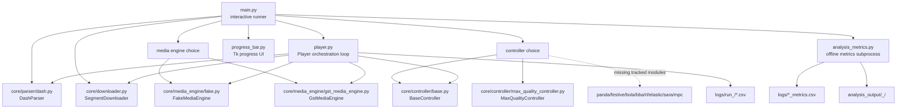
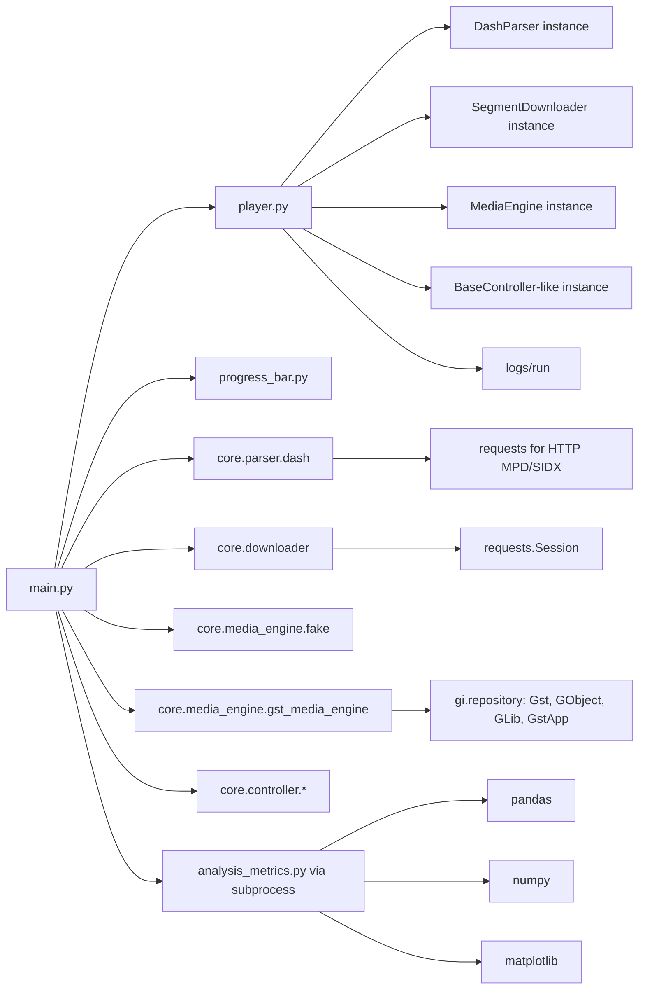

# ABR Benchmarking Client Skeleton Audit

Date: 2026-05-06

Scope: audit-only inspection of the current repository as an ABR benchmarking client skeleton. Runtime code was not changed.

## Executive Summary

The repository has the right intended boundaries for an ABR client: MPD parser, downloader, media engine, controller interface, player loop, logging, and offline analysis. In the current state, however, the benchmark harness is not baseline-ready or ABR-neutral yet.

The most important blockers are:

- `main.py` is not importable from tracked files because it imports controller modules that are not present in `core/controller`.
- `requirements.txt` is empty. The local venv has `requests`, but not `pandas`, `numpy`, `matplotlib`, `gi`, or GStreamer bindings needed by the analysis and real playback paths.
- The actual run path is interactive and hard-coded: engine, controller, MPD URL, RL model path, headless mode, and output layout are not driven by a reproducible experiment config.
- `Player` contains several benchmark policies that can affect ABR results: initial controller call, one-segment warm-up freeze, buffer cap pacing, retry backoff, automatic downshift on repeated download errors, pre-roll exclusion, phase labeling, and final-stall suppression.
- Offline analysis currently reads `logs/*_metrics.csv`, while `Player` writes run-scoped CSVs under `logs/run_<timestamp>/...`, so automatic analysis can miss the latest run or compare stale files.

## 1. Architecture Map

### Current Component Layout

### Entry Point: `main.py`

Responsibilities currently mixed in the entry point:

- Configures logging to `logs/main.log`.
- Prompts interactively for media engine and controller.
- Imports many controller classes, but only `MaxQualityController` exists in tracked files.
- Uses a hard-coded LAN MPD URL.
- Creates `DashParser`, `SegmentDownloader`, media engine, controller, `Player`, and optional `ProgressBarWindow`.
- Runs `Player` in a non-daemon thread.
- Starts Tk GUI by default because `HEADLESS = False`.
- After playback, launches `analysis_metrics.py` via subprocess.

Important current issues:

- Importing `main.py` fails with `ModuleNotFoundError: No module named 'core.controller.panda_controller'`.
- `config/client.example.yaml` and `config/client.local.yaml` exist, but `main.py` does not read them.
- Controller/model choices are not discoverable from the filesystem or config.
- The RL model path is hard-coded to a user-specific path outside the repository.

### MPD Parser: `core/parser/dash.py`

Responsibilities:

- Loads MPD from HTTP via `requests.get` or from local filesystem via `ElementTree`.
- Extracts global MPD fields: `minBufferTime`, `type`, `mediaPresentationDuration`, `maxSegmentDuration`, profiles, availability/publish timestamps, and program info.
- Supports `SegmentList`, `SegmentTemplate`, and `SegmentBase`/SIDX-style parsing.
- Builds a nested `periods -> adaptationSets -> representations` structure.
- Adds representation metadata: id, mime type, bandwidth, dimensions, codecs, frame rate, init URL, segment URLs, fragment duration, segment durations, and byte ranges.

Important current issues:

- `abs_url` concatenates `base_url + url` instead of using URL joining consistently.
- `SegmentTemplate` segment count is inferred by rounding `period_seconds * timescale / duration`; if duration is absent, it silently falls back to 30 segments.
- Last segment duration is capped to nominal duration, which may hide MPD duration mismatches.
- Parser extracts `byte_ranges`, but the current `Player` `SegmentBase` branch does not use the parser-produced byte ranges.
- Parser does not obviously validate switch-compatibility across representations.

### Downloader: `core/downloader.py`

Responsibilities:

- Uses a `requests.Session`.
- Downloads complete resources with optional byte range.
- Uses headers: `Accept-Encoding: identity`, `Connection: keep-alive`, `Cache-Control: no-cache`, `Pragma: no-cache`.
- Retries failed requests up to `max_retries` with fixed 0.5 s sleep between downloader-level attempts.
- Reports elapsed total time, payload size, HTTP status, content length/range headers, and attempt count.
- Provides async and multi-download helpers.
- Provides file-size detection via `HEAD`, then fallback range GET.

Important current issues:

- `ttfb` is always `0.0`; no separation between connect latency, first byte, payload time, and Python copy time.
- Full `resp.content` buffering means throughput measurement includes complete in-memory materialization, not streaming consumption.
- Downloader retry behavior is separate from `Player` retry behavior, creating two retry layers.
- No abort/cancel API exists, so controllers cannot model abandoning an in-flight request.
- `requests.Session` and keep-alive can make run order and server/cache state matter if experiments are not controlled.

### Media Engines

#### `core/media_engine/base.py`

Defines the intended API:

- `start()`, `stop()`
- `push_data(...)`
- `get_queued_bytes()`
- `get_queued_time()`
- `get_status()`

Important current issue:

- The interface is informal and not enforced as a protocol or abstract base class. Event payload schemas are not standardized.

#### `core/media_engine/fake.py`

Responsibilities:

- Simulates playback with a monotonic clock.
- Maintains an in-memory list of buffered segments.
- Starts playback once queued time reaches `min_queue_time`.
- Pauses when buffer is effectively empty.
- Emits events: `segment-pushed`, `segment-popped`, `stall`, `stall_recovered`, `playback-finished`.
- Measures stall duration using `time.perf_counter`.

Benchmark relevance:

- Useful for deterministic and headless testing.
- Still depends on real wall-clock sleeps, Python thread scheduling, and real network download times unless paired with a fake downloader/network model.

#### `core/media_engine/gst_media_engine.py`

Responsibilities:

- Builds a GStreamer pipeline: `appsrc -> qtdemux -> h264parse -> queue -> avdec_h264 -> autovideosink` or `fakesink`.
- Maintains a logical timeline from pushed segment durations.
- Uses GStreamer queue signals and pipeline position to infer playback, queue time, stalls, segment pops, and finish.
- Has near-end clamping and telemetry to avoid final-tail artifacts.

Benchmark relevance:

- Valuable for real playback validation.
- Not equivalent to the fake engine: decode cost, GStreamer scheduling, sink behavior, queue properties, and logical-time clamps can alter stall timing and buffer observations.

### Controller Layer

#### `core/controller/base.py`

Current API:

- Controller stores feedback via `setPlayerFeedback`.
- Controller computes target rate via `calcControlAction`.
- Player converts target rate to level via `quantizeRate`.
- Controller may set an idle duration via `setIdleDuration`.
- `isBuffering` uses `feedback['max_buffer_time']` if present, otherwise default threshold 10 s.

Important current issues:

- Action is a target rate, not a level. Quantization is performed outside the controller.
- The controller can influence pacing via idle duration, so ABR logic and scheduler policy are coupled.
- Feedback schema is implicit and mutable.
- `Player` also calls optional `controller.augment_feedback`, allowing controller-specific observation mutation before decisions and logging.

#### `core/controller/max_quality_controller.py`

Current tracked concrete controller:

- Always chooses `max_level`.
- Forces idle duration to `0.0`.
- Uses player-provided `bwe`, buffer, rates, and prior download metrics for debug/diagnostics.
- Debug printing is enabled by default.

Benchmark relevance:

- Useful as an upper-bound stress baseline, not a fair ABR controller.
- Default debug output can perturb wall-clock timing in tight loops.

### Playback Orchestrator: `player.py`

Responsibilities:

- Reloads MPD from `mpd_url`.
- Selects video adaptation sets, flattens representations, and sorts them by bandwidth.
- Builds per-level segment lists including init segments or virtual init placeholders.
- Runs a sequential download/push/adapt loop.
- Computes feedback for controllers.
- Calls controller initially, then after each non-init segment except a one-segment warm-up.
- Pushes data to media engine.
- Handles retries and repeated failure downshift.
- Applies buffer cap pacing before downloading media segments.
- Records a full dataset CSV and a smaller training CSV.
- Tracks stalls through media engine events and flushes CSV rows when segments are popped.
- Computes derived features: throughput now/EWMA/min/std, buffer over segment duration, headroom, phase labels, pre-roll flags.

Important current issues:

- ABR-neutrality is compromised because player-level policies can affect outcomes independently of controllers.
- Segment alignment assumes compatible representations with common item counts and init layout.
- `_last_common_index` uses the minimum representation length, but the loop later uses `len(self.segments_per_level[0])`.
- The `SegmentBase` branch estimates equal byte ranges from file size instead of using parser SIDX byte ranges.
- `bwe` falls back to current bitrate when no measured segment exists.
- `use_for_eval` excludes the first 10 wall-clock seconds, not a fixed media interval or fixed segment count.
- Final segment stall is suppressed in `_flush_segment_row`.
- Output path is nested under `logs/run_<timestamp>/...`, but `analysis_metrics.py` expects top-level `logs/*_metrics.csv`.

### Progress UI: `progress_bar.py`

Responsibilities:

- Polls player/media engine from Tk every 200 ms by default.
- Shows current time, buffer time/bytes, downloaded and playing fragment counters, current level, current bitrate, and `bwe`.

Benchmark relevance:

- Useful for manual inspection.
- Should be disabled for benchmark runs because GUI polling and Tk scheduling add uncontrolled runtime overhead.

### Offline Analysis: `analysis_metrics.py`

Responsibilities:

- Reads CSVs matching `logs/*_metrics.csv`.
- Coerces expected columns.
- Computes startup delay, rebuffer count/duration/ratio, bitrate mean/std, switches, switch rate per minute, playback time, average download time, throughput, bytes downloaded.
- Produces summary CSV, ranking CSV, plots, timelines, and cleaned per-run CSVs.
- Builds a min-max normalized QoE score with fixed weights: bitrate 0.40, rebuffer ratio 0.30, switch rate 0.20, startup delay 0.10.

Important current issues:

- The input glob does not match `Player`'s run-scoped output.
- QoE score depends on the set of algorithms included in the current analysis because of min-max normalization.
- Analysis does not take an explicit experiment manifest, repetition set, network trace, content hash, config hash, or git commit.
- The local venv does not include `pandas`, `numpy`, or `matplotlib`.

## 2. Runtime Dependency Map

### Local Module Dependencies

### Python and Package Dependencies

Observed local interpreter:

- `.venv` Python: `3.12.8`.

Tracked dependency declaration:

- `requirements.txt` is empty.

Observed local venv packages:

- `requests==2.33.1`
- `certifi==2026.4.22`
- `charset-normalizer==3.4.7`
- `idna==3.13`
- `urllib3==2.6.3`

Required by code but absent from the local venv:

- `pandas`, `numpy`, `matplotlib` for `analysis_metrics.py`.
- `gi` / PyGObject and system GStreamer libraries/plugins for `GstMediaEngine`.
- Missing controller modules referenced by `main.py`: `panda_controller`, `festive_controller`, `bola_controller`, `bba_controller`, `rl_ppo_controller`, `rl_ppo_controller_basic`, `elastic_controller`, `sara_controller`, `mpc_controller`.
- Possible future RL dependencies implied by names and hard-coded model path, likely external ML libraries, but they are not represented in tracked files.

### Runtime Data Dependencies

- DASH MPD and media segments are external by design.
- `main.py` uses a hard-coded LAN MPD URL.
- `config/client.example.yaml` defines `mpd_url`, `playback.start_quality`, buffer limits, and logging fields, but current runtime does not consume it.
- `config/client.local.yaml` is ignored and currently has an empty `mpd_url`.
- Logs and analysis output are ignored by git.
- No tracked experiment manifest records content identity, network profile, controller settings, run count, seeds, or expected output schema.

### Runtime Mode Dependencies

- Fake engine mode depends on Python timing, thread scheduling, and real download timing.
- GStreamer mode depends on installed system codecs/plugins, sink selection, decode load, and GStreamer queue/pipeline behavior.
- GUI mode depends on Tk availability and adds polling overhead.
- Analysis mode depends on a data layout that currently does not match the player output layout.

## 3. Hidden Experimental Assumptions That Could Bias ABR Comparisons

### Critical Bias Risks

- **Entry point imports missing controllers.** The benchmark runner cannot start from tracked files, so any current comparison depends on untracked local controller files.
- **Hard-coded MPD and model paths.** Runs depend on one LAN server and one user-specific RL model path instead of an experiment manifest.
- **Interactive choices are not captured.** Engine/controller selections are typed at runtime and not automatically persisted as canonical config.
- **Config files are unused.** Buffer thresholds and MPD URL in `config/client.example.yaml` do not define actual behavior.
- **Analysis input mismatch.** `Player` writes nested run CSVs, while `analysis_metrics.py` globs top-level `logs/*_metrics.csv`, risking stale or missing comparisons.
- **Benchmark policies live in `Player`.** Warm-up freeze, buffer cap pacing, retry backoff, automatic downshift, final-stall suppression, and pre-roll exclusion influence outcomes independently of controller logic.
- **Download failure policy changes quality outside the controller.** After repeated failures, `Player` reduces `cur_level` directly. Aggressive controllers may be penalized or rescued by player behavior that is not part of their algorithm.
- **No controlled network model.** Real LAN/server/cache conditions can vary between runs and algorithms.

### Observation and Action Biases

- **Controller action is rate-based, but playback uses levels.** `BaseController.quantizeRate` floors rates to a level. Duplicate or non-monotonic representations could produce unexpected choices.
- **Feedback schema is implicit.** Controllers may use different subsets of `queued_time`, `bwe`, timestamps, `rates`, `max_level`, and segment index, with no schema contract.
- **Controllers can mutate feedback.** Optional `augment_feedback` lets a controller alter its own observations and logged row context.
- **Initial `bwe` fallback equals current bitrate.** First decisions receive a synthetic bandwidth estimate tied to the starting quality.
- **One-segment warm-up freeze.** The first non-init segment after initial selection is not adapted, which affects startup, early stalls, and first logged decisions.
- **Controller idle duration is part of the API.** A controller can insert waits after each segment, blending ABR choice with scheduler/pacing behavior.

### Parser and Content Assumptions

- **Representations are flattened across video adaptation sets.** Sorting all video representations by bandwidth can cross codecs, resolutions, frame rates, or adaptation-set boundaries that are not safely switchable.
- **All levels are assumed segment-aligned.** The player builds a common index model but does not enforce equal duration/count/range compatibility before switching.
- **Loop length uses level 0.** `_last_common_index` tracks the minimum length, but the main loop uses `len(self.segments_per_level[0])`.
- **SegmentBase ranges are re-estimated.** Player estimates equal-size byte ranges instead of using exact parser/SIDX ranges, which can distort segment sizes and throughput.
- **Template segment counts are inferred.** Rounding and fallback to 30 segments may create silent differences from the actual MPD timeline.
- **Last segment durations are adjusted.** Duration capping and final-stall suppression can hide tail behavior that affects QoE.

### Measurement Biases

- **Throughput is measured as full response bytes over total elapsed request time.** It includes request overhead and memory buffering, and lacks TTFB/payload separation.
- **`ttfb` is always zero.** Any controller expecting first-byte timing cannot get it from the common telemetry.
- **Two retry layers exist.** Downloader-level retries and player-level retries/backoff both influence observed throughput and stalls.
- **Pre-roll exclusion is wall-clock based.** Fast and slow algorithms may exclude different numbers of media segments.
- **Startup delay is not playback-start delay.** Analysis estimates startup from first request to first non-init segment completion, not time until the engine actually starts rendering after `min_queue_time`.
- **Final stall is ignored.** Last segment stall suppression may make tail behavior look cleaner than experienced playback.
- **Wall-clock and monotonic clocks are mixed.** CSV timestamps use `time.time`, request timing uses `perf_counter`, and media engines differ in event timestamp semantics.
- **Console and debug output can perturb timing.** `MaxQualityController(debug=True)`, player prints, downloader events, GStreamer logs, and GUI polling all add variable overhead.
- **QoE ranking is relative to the current comparison set.** Min-max normalization changes scores when algorithms are added or removed.

### Engine Biases

- **Fake and GStreamer engines do not observe the same world.** Fake playback consumes logical segment duration and bytes, while GStreamer depends on decoder, queue, sink, pipeline clock, and codec validity.
- **Engine thresholds are not centralized.** Base engine defaults to 10 s, fake defaults to 1 s, GStreamer defaults to 5 s, and `main.py` passes 1 s in both modes.
- **GStreamer near-end clamps affect measured buffer/stalls.** Real-engine tail behavior is modified by logical near-end rules.
- **GUI default is on.** Non-headless mode changes timing and should not be part of automated benchmarks.

### Reproducibility Gaps

- **No dependency lock.** The repo cannot recreate the environment from `requirements.txt`.
- **No experiment manifest.** Runs do not record git commit, config hash, content identity, server identity, network profile, repetitions, or random seeds.
- **No smoke tests or parser fixtures.** `tests` is effectively empty, and `core/parser/test_parser.py` is a manual script with a hard-coded URL and incorrect import path (`from dash import DashParser`).
- **No generated output schema version.** CSV columns are assembled dynamically from feedback keys and derived fields.

## 4. Prioritized Hardening Plan

### P0: Make the Skeleton Runnable and Reproducible

1. **Restore importability from tracked files.**
   - Replace eager controller imports in `main.py` with a registry that only exposes installed/tracked controllers.
   - Keep optional controllers behind lazy imports or extras.
   - Add an import smoke test for `main`, `player`, parser, downloader, fake engine, and available controllers.

2. **Create a non-interactive experiment runner.**
   - Read a YAML/JSON config with `mpd_url`, engine, controller, output dir, initial level, buffer thresholds, headless flag, and analysis options.
   - Keep interactive mode only as a manual demo path.
   - Default benchmark mode to headless.

3. **Pin and document runtime dependencies.**
   - Add tracked Python dependencies for the core path and analysis path.
   - Document GStreamer/PyGObject as system dependencies or optional extras.
   - Add a small environment check script that reports missing core, analysis, and real-engine dependencies.

4. **Unify run output layout.**
   - Make each run write to one explicit `runs/<run_id>/` or `logs/<run_id>/` directory.
   - Store `metrics.csv`, `training.csv`, `config.resolved.yaml`, `environment.json`, and `manifest_summary.json`.
   - Update `analysis_metrics.py` to consume explicit run dirs or an experiment manifest, not stale global globs.

5. **Record reproducibility metadata.**
   - Log git commit, dirty state, Python version, package versions, OS, engine mode, controller class and params, MPD URL, MPD hash/content summary, and run start time.
   - For external content, store a manifest inventory with representation ids, bandwidths, segment counts, durations, and optionally segment sizes/hashes outside the repo.

### P1: Make Runtime ABR-Neutral

6. **Define a strict controller protocol.**
   - Use one action type: preferably `quality_level`, not arbitrary target rate.
   - Use an immutable observation object with a schema version.
   - Remove or formalize `augment_feedback`.
   - Decide whether scheduler idle is part of ABR; if not, remove `getIdleDuration` from controller influence during benchmark runs.

7. **Move benchmark policies into explicit config.**
   - Make warm-up behavior, initial level, buffer cap, retry policy, final-stall handling, pre-roll exclusion, and min queue time explicit and logged.
   - For baseline-ready ABR comparison, use the same configured client policy for all controllers.

8. **Separate scheduler, downloader, buffer, engine, metrics, and ABR.**
   - Keep `Player` as orchestration, but push ABR observations/actions through a narrow adapter.
   - Ensure download failure handling does not silently alter quality outside the controller.
   - Emit raw events first; derive metrics offline.

9. **Normalize initial and network conditions.**
   - Use fixed initial quality and initial buffer policy across all algorithms.
   - Disable GUI and noisy debug logs in benchmark mode.
   - Use a controlled local content server and controlled bandwidth/latency traces, or a deterministic fake downloader for skeleton tests.
   - Randomize or counterbalance run order when using real network/server paths.

10. **Validate representation compatibility before playback.**
    - Fail fast if adaptation sets/codecs/timelines are not switch-compatible.
    - Enforce equal media segment counts or define exact behavior for ragged representations.
    - Use parser-produced SIDX byte ranges instead of equal partition estimates.
    - Use robust URL joining and add parser fixtures for SegmentList, SegmentTemplate, SegmentTimeline, and SegmentBase/SIDX.

### P2: Make Metrics Baseline-Ready

11. **Adopt an event log as the source of truth.**
    - Log events such as `request_start`, `response_headers`, `response_complete`, `segment_pushed`, `playback_start`, `stall_start`, `stall_end`, `decision_start`, `decision_end`, `segment_played`, and `eos`.
    - Use monotonic timestamps consistently.
    - Keep CSV summaries as derived artifacts.

12. **Measure network timing more precisely.**
    - Capture status, bytes, content length, content range, TTFB, payload elapsed, total elapsed, retry count, and exception class.
    - Decide whether connection reuse is enabled, and log that decision.
    - Make cache/server warm-up rules explicit.

13. **Rework analysis around experiment manifests.**
    - Analyze a declared set of runs and repetitions.
    - Report raw metrics first: mean bitrate, rebuffer duration/count/ratio, startup-to-playback, switches, downloaded bytes, throughput, and decision latency.
    - Add confidence intervals or per-run distributions.
    - Keep QoE scoring configurable and avoid hidden min-max ranking as the default headline.

14. **Make evaluation windows neutral.**
    - Prefer fixed media-time windows or explicit segment ranges over wall-clock pre-roll.
    - Log which samples are excluded and why.
    - Treat startup and steady-state metrics separately.

### P3: Add Guardrails and Developer Workflow

15. **Build tests before adding more ABR controllers.**
    - Parser fixture tests.
    - Fake engine deterministic playback tests.
    - Player loop tests with a fake downloader and fake controller.
    - CSV/event schema tests.
    - Import smoke tests.

16. **Split real playback validation from ABR benchmark runs.**
    - Use fake/deterministic engine for controlled benchmark skeleton tests.
    - Use GStreamer mode to validate real media compatibility and presentation behavior.
    - Do not mix fake-engine and real-engine results in the same ABR ranking unless the experiment explicitly studies engine effects.

17. **Add a baseline controller set only after the client contract is stable.**
    - Fixed lowest quality.
    - Fixed highest quality / stress baseline.
    - Fixed middle quality.
    - Throughput-rule baseline.
    - Buffer-rule baseline.

18. **Add runbooks and CI checks.**
    - `scripts/smoke`: import and fake-run checks.
    - `scripts/eval`: config-driven experiment execution.
    - `scripts/setup`: environment validation.
    - CI or local command that verifies no heavy DASH content is tracked.

## Suggested First Implementation Sequence

1. Make `main.py` importable by replacing missing eager controller imports with a registry of available controllers.
2. Add a config-driven, headless runner path that can execute `MaxQualityController` with `FakeMediaEngine`.
3. Fix output paths so analysis consumes the latest run explicitly.
4. Add dependency declarations for core and analysis.
5. Add smoke tests for parser import, player import, fake engine, downloader import, and one fake benchmark run using a stub downloader.
6. Only then start hardening the ABR controller contract.

That sequence keeps Phase 1 focused on a clean, reproducible base client before adding or comparing serious ABR algorithms.
